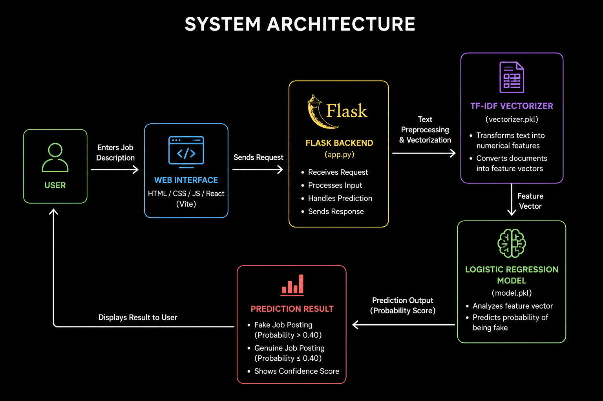
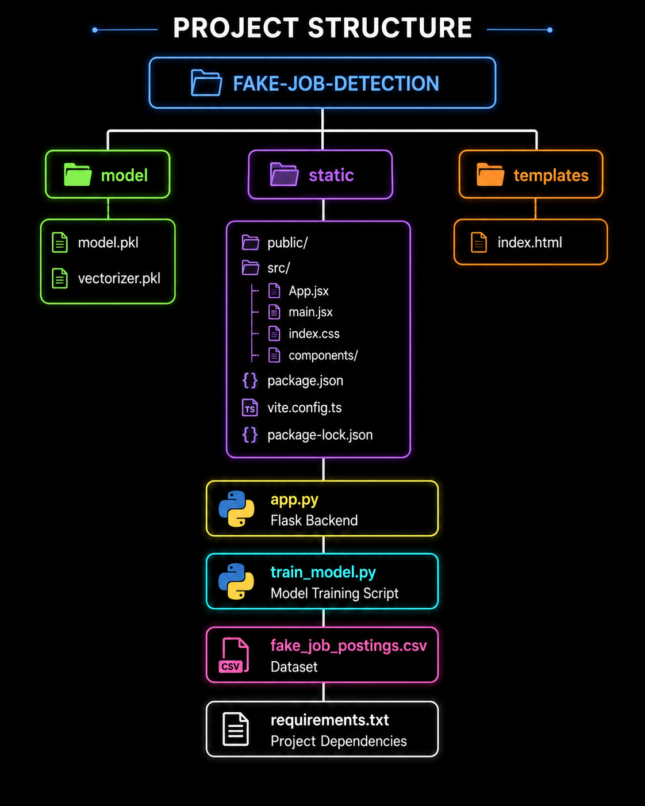

<h1 align="center">Fake Job Detection System</h1>

<h2 align="center">A machine learning-based web application that detects fraudulent job postings by analyzing job descriptions using Natural Language Processing (NLP) and classification techniques. The system helps job seekers identify potentially fake job opportunities before applying.</h2>
<h2>Overview</h2>
The rise of online recruitment platforms has made job searching easier than ever. However, it has also increased the number of fraudulent job postings that mislead candidates through fake offers, unrealistic salaries, registration fees, or misleading company information.
 
The Fake Job Detection System addresses this problem by applying machine learning techniques to analyze job descriptions and classify them as either genuine or fraudulent. The application provides instant predictions along with confidence scores, enabling users to make informed decisions.
<h2>Features</h2>

* Machine Learning-based fake job detection
* Real-time job description analysis
* TF-IDF text vectorization
* Logistic Regression classification model
* Confidence score generation
* Responsive web interface
* Fast prediction results
* Flask-based backend processing
* Deployed web application for easy accessibility
<h2>Tech Stack</h2>
<h3>Frontend</h3>

* HTML
* CSS
* JavaScript
* React (Vite)
<h3>Backend</h3>

* Python
* Flask
<h3>Machine Learning</h3>

* Scikit-learn
* TF-IDF Vectorizer
* Logistic Regression
* Joblib
<h3>Deployment</h3>

* Vercel

<h2>Working Methodology</h2>
<h2>Step 1: User Input</h3>
The user enters a job description into the application interface.
<h3>Step 2: Text Processing</h3>
The submitted text is processed using a trained TF-IDF Vectorizer, which converts textual information into numerical features.
<h3>Step 3: Feature Extraction</h3>
Relevant patterns and word frequencies are extracted from the job description.
<h3>Step 4: Model Prediction</h3>
The Logistic Regression model analyzes the extracted features and predicts the probability of the posting being fraudulent.
<h3>Step 5: Classification</h3>
A threshold value is applied:

* Probability > 0.40 → Fake Job Posting
* Probability ≤ 0.40 → Genuine Job Posting
<h3>Step 6: Result Display</h3>
The prediction result along with a confidence score is displayed to the user.

<h2>Machine Learning Pipeline</h2>
<h3>Dataset</h3>
The model is trained on a dataset containing both legitimate and fraudulent job postings.
<h3>Text Vectorization</h3>
TF-IDF (Term Frequency – Inverse Document Frequency) is used to convert textual job descriptions into numerical feature vectors.
<h3>Model Training</h3>
A Logistic Regression classifier is trained on the processed dataset.
<h3>Model Storage</h3>
The trained model and vectorizer are saved using Joblib:

* model.pkl
* vectorizer.pkl
<h3>Prediction</h3>
User input is transformed using the saved vectorizer and evaluated by the trained model to generate predictions.
<h2>Installation and Setup</h2>
Clone Repository

git clone https://github.com/Tanishttha/fake-job-detection.git
cd fake-job-detection

Create Virtual Environment

python -m venv .venv

Activate Virtual Environment

macOS/Linux

source .venv/bin/activate

Windows

.venv\Scripts\activate

Install Dependencies

pip install -r requirements.txt

Run Application

python app.py

Application will run on:

http://127.0.0.1:5000

⸻

Live Demo

Website:
https://fake-jobdetect.vercel.app

⸻

Project Samples

Project Samples PDF:
[Insert PDF Link Here]

⸻

Screenshots

Home Page

[Insert Screenshot Here]

Job Analysis Interface

[Insert Screenshot Here]

Prediction Result

[Insert Screenshot Here]

⸻

Example

Input

We are hiring remote data entry operators.
No experience required.
Earn ₹50,000 per week.
Registration fee required before joining.

Output

Fake Job Posting

⸻

Future Enhancements

* Company authenticity verification
* URL-based job analysis
* Explainable prediction reports
* Improved NLP models
* User feedback system
* Advanced fraud detection techniques

⸻

Author

Tushar Banga

B.Tech Computer Engineering
J.C. Bose University of Science & Technology, YMCA

⸻

License

This project is intended for academic, educational, and research purposes.