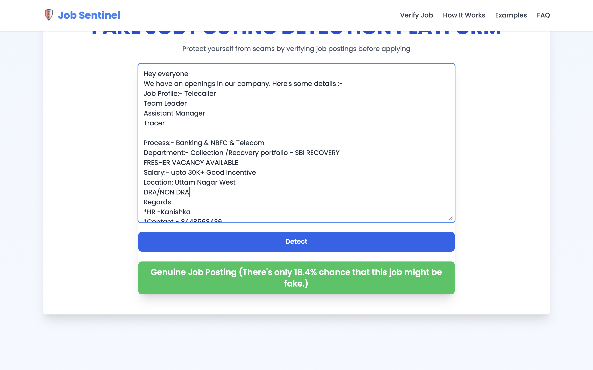

<h1 align="center">Fake Job Detection System</h1>

<h2 align="center">A machine learning-based web application that detects fraudulent job postings by analyzing job descriptions using Natural Language Processing (NLP) and classification techniques. The system helps job seekers identify potentially fake job opportunities before applying.</h2>
<h2>Overview</h2>
The rise of online recruitment platforms has made job searching easier than ever. However, it has also increased the number of fraudulent job postings that mislead candidates through fake offers, unrealistic salaries, registration fees, or misleading company information.
<br>
The Fake Job Detection System addresses this problem by applying machine learning techniques to analyze job descriptions and classify them as either genuine or fraudulent. The application provides instant predictions along with confidence scores, enabling users to make informed decisions.
<h2>Features</h2>

* Machine Learning-based fake job detection
* Real-time job description analysis
* TF-IDF text vectorization
* Logistic Regression classification model
* Confidence score generation
* Responsive web interface
* Fast prediction results
* Flask-based backend processing
* Deployed web application for easy accessibility
<h2>Tech Stack</h2>
<h3>Frontend</h3>

* HTML
* CSS
* JavaScript
* React (Vite)
<h3>Backend</h3>

* Python
* Flask
<h3>Machine Learning</h3>

* Scikit-learn
* TF-IDF Vectorizer
* Logistic Regression
* Joblib
<h3>Deployment</h3>

* Vercel


<h2>Working Methodology</h2>
<h2>Step 1: User Input</h3>
The user enters a job description into the application interface.
<h3>Step 2: Text Processing</h3>
The submitted text is processed using a trained TF-IDF Vectorizer, which converts textual information into numerical features.
<h3>Step 3: Feature Extraction</h3>
Relevant patterns and word frequencies are extracted from the job description.
<h3>Step 4: Model Prediction</h3>
The Logistic Regression model analyzes the extracted features and predicts the probability of the posting being fraudulent.
<h3>Step 5: Classification</h3>
A threshold value is applied:

* Probability > 0.40 → Fake Job Posting
* Probability ≤ 0.40 → Genuine Job Posting
<h3>Step 6: Result Display</h3>
The prediction result along with a confidence score is displayed to the user.


<h2>Machine Learning Pipeline</h2>
<h3>Dataset</h3>
The model is trained on a dataset containing both legitimate and fraudulent job postings.
<h3>Text Vectorization</h3>
TF-IDF (Term Frequency – Inverse Document Frequency) is used to convert textual job descriptions into numerical feature vectors.
<h3>Model Training</h3>
A Logistic Regression classifier is trained on the processed dataset.
<h3>Model Storage</h3>
The trained model and vectorizer are saved using Joblib:

* model.pkl
* vectorizer.pkl
<h3>Prediction</h3>
User input is transformed using the saved vectorizer and evaluated by the trained model to generate predictions.
<h2>Installation and Setup</h2>
<h3>Clone Repository</h3>

```bash
git clone https://github.com/Tanishttha/fake-job-detection.git
cd fake-job-detection
```
<h3>Create Virtual Environment</h3>

```bash
python -m venv .venv
```
<h3>Activate Virtual Environment</h3>
macOS/Linux

```bash
source .venv/bin/activate
```
Windows

```bash
.venv\Scripts\activate
```
<h3>Install Dependencies</h3>

```bash
pip install -r requirements.txt
```
<h3>Run Application</h3>

```bash
python app.py
```
Application will run on:

```bash
http://127.0.0.1:5000
```
<h2>Live Demo</h2>

```bash
https://fake-jobdetect.vercel.app
```
<h2>Project Samples</h2>
Project Samples PDF:

```bash
https://drive.google.com/drive/folders/1WAdBopz1THfS4_hh9l0eImHjDv2hNl8j
```
<h3>Screenshots</h3>


<p align="center">
  <b>Home Page</b>
</p>


<p align="center">
  <b>Prediction Result</b>
</p>
<h2>Example</h2>
<h3>Input</h3>

```bash
Hey everyone 
We have an openings in our company. Here's some details :- 
 Job Profile:- Telecaller
                           Team Leader
                           Assistant Manager 
                           Tracer 
 Process:- Banking & NBFC & Telecom
 Department:- Collection /Recovery portfolio - SBI RECOVERY 
FRESHER VACANCY AVAILABLE 
 Salary:- upto 30K+Good Incentive
 Location: Uttam Nagar  West                  
 DRA/NON DRA
 
Regards
HR -Kanishka 
Contact - 8448568436
```
<h3>Output</h3>

```bash
Genuine Job Posting (There's only 18.4% chance that this job might be fake.)
```
<h2>Future Enhancements</h2>

* Company authenticity verification
* URL-based job analysis
* Explainable prediction reports
* Improved NLP models
* User feedback system
* Advanced fraud detection techniques
<h2>License</h2>
This project is intended for academic, educational, and research purposes.
